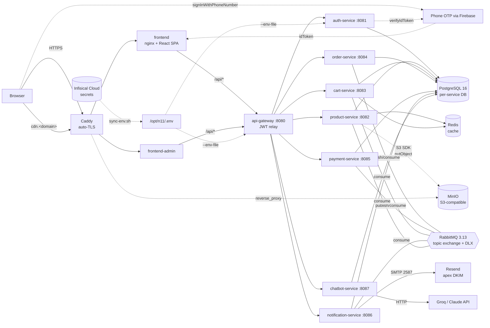
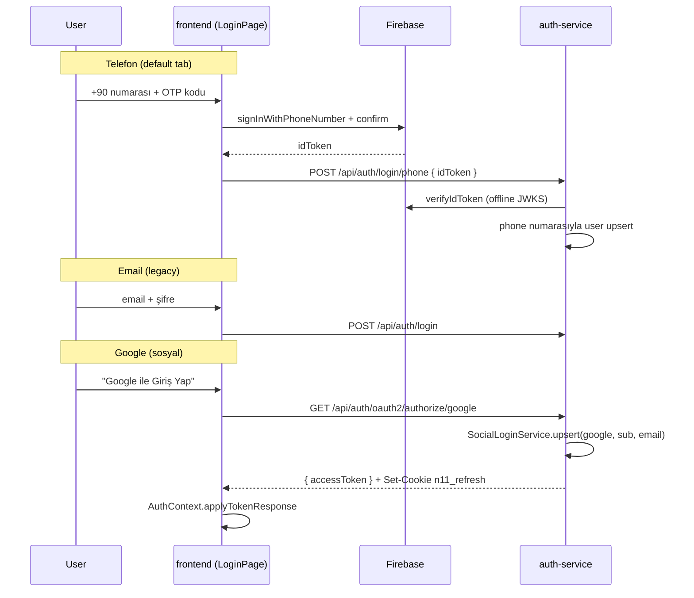
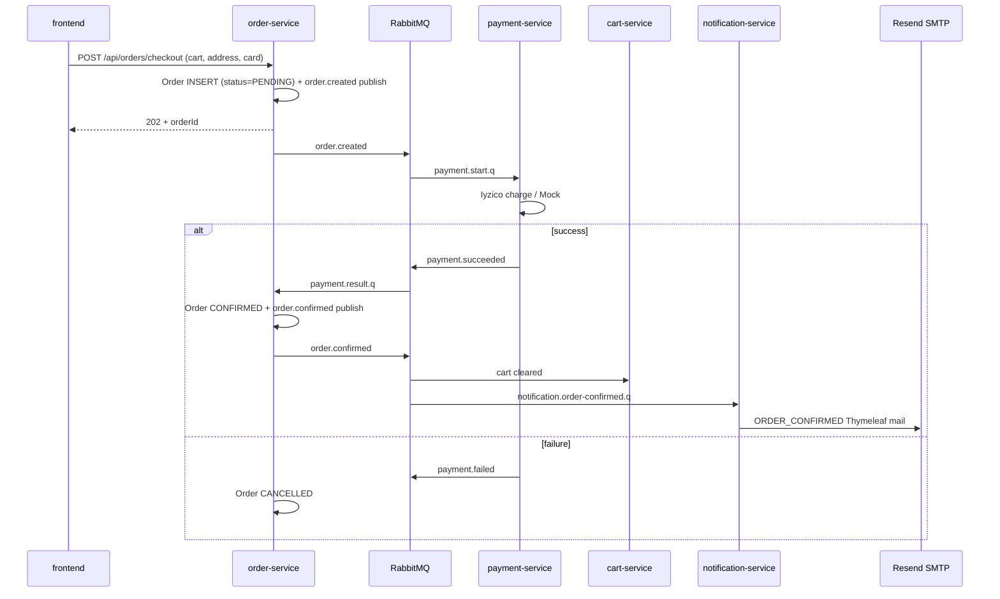
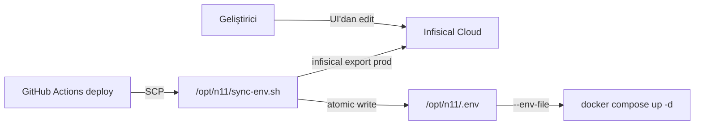

# n11 Final Case — E-Ticaret

## 🚀 Canlı Ortam

| | URL |
|---|---|
| 🛍️ **Storefront** | <https://n11proje.samedbilgin.com> |
| 🛠️ **Admin Paneli** | <https://n11proje.samedbilgin.com/admin> |
| 📚 **Swagger (API Docs)** | <https://n11proje.samedbilgin.com/swagger-ui.html> |
| 🖼️ **CDN (ürün görselleri)** | <https://cdn.n11proje.samedbilgin.com> |
| 📦 **MinIO Konsol** | <https://minio.n11proje.samedbilgin.com> *(basic-auth)* |

> DigitalOcean droplet + GHCR + Caddy auto-TLS üzerinde çalışıyor; her `main` push'unda GitHub Actions ile otomatik deploy.

---

Spring Boot 3.3 / Java 21 **7 mikroservis** (auth, product, cart, order, payment,
**chatbot (Groq / Claude)** ve gateway), RabbitMQ üzerinde **choreography saga**, JWT auth,
Iyzico ödeme entegrasyonu, **n11 magenta** temalı React + Vite + Tailwind frontend
(component-driven, mock-data backed) ve **GitHub Actions → DigitalOcean droplet + GHCR**
deploy boru hattı (her deploy'da Slack bildirimi).

| | |
|---|---|
| **Backend** | Spring Boot 3.3.4, Java 21, Spring Cloud Gateway 2023.0.3, JPA + Flyway + PostgreSQL 16 |
| **Mesajlaşma** | RabbitMQ 3.13 — topic exchange, durable queues, JSON message converter |
| **Auth** | **3 kanal**: email + şifre (BCrypt), Google OAuth2, **Telefon + SMS OTP (Firebase Phone Auth)** — hepsi tek JWT akışında birleşir; refresh token rotation + reuse-detection |
| **Ödeme** | iyzipay-java 2.0.65 (sandbox/prod toggle); offline `MockPaymentGateway` fallback |
| **Mail** | Resend SMTP (port 2587, DO 587'yi blokluyor) + Thymeleaf template; apex-domain DKIM verify; dev için MailHog |
| **AI Asistan** | Pluggable provider — **Groq** (free, OpenAI-compatible, default) / **Anthropic Claude** / **Mock**; ürün katalog grounding ile RAG |
| **Frontend** | React 18, Vite 5, Tailwind 3 (n11 magenta tema), react-router 6, axios, react-hot-toast, framer-motion; lazy-loaded Firebase chunk; 6-kutulu OTP UI |
| **DevOps** | Docker Compose, Jib, GitHub Actions, **DigitalOcean droplet** (SSH deploy), **GHCR** (free image registry), Caddy reverse proxy + auto-TLS, Slack webhook (yalnızca CI/CD deploy bildirimi) |
| **Secrets** | **Infisical** managed secret store + Universal Auth machine identity → `sync-env.sh` her deploy'da `/opt/n11/.env` üretir, manuel `nano .env` yok |
| **Observability** | Correlation ID propagation (HTTP + AMQP), Micrometer + Prometheus metrics, **OpenTelemetry → Jaeger** distributed tracing (UI basic-auth korumalı `$JAEGER_DOMAIN`), **Sentry** error tracking — frontend (React + replay + sourcemap upload) + 8 backend servisi tek projede service-tag'larıyla |
| **Test** | JUnit 5 + Mockito + Testcontainers (PostgreSQL) |

## İçindekiler

- [Mimari](#mimari)
- [Servisler](#servisler)
- [Saga Akışı](#saga-akışı)
- [Çalıştırma](#çalıştırma)
- [Test](#test)
- [API Dokümantasyonu](#api-dokümantasyonu)
- [CI/CD](#cicd)
- [Deployment](#deployment)
- [Klasör Yapısı](#klasör-yapısı)

> Detaylı dokümantasyon `docs/` altındadır — [`docs/README.md`](docs/README.md) ile başla.
>
> **Yüksek seviye:**
> - [`docs/architecture.md`](docs/architecture.md) — mimari diyagram + tasarım kararları
> - [`docs/developer-guide.md`](docs/developer-guide.md) — felsefe + tüm "neden" ler
> - [`docs/saga.md`](docs/saga.md) — saga waterfall, compensation, idempotency
>
> **Topical (cross-cutting konseptler):**
> - [`docs/auth-flows.md`](docs/auth-flows.md) — **3 login akışı (email, Google, telefon-OTP) sequence diagram + kod ref + onboarding + checkout email gate**
> - [`docs/secrets-management.md`](docs/secrets-management.md) — **Infisical + sync-env.sh + machine identity + rotation**
> - [`docs/messaging.md`](docs/messaging.md) — RabbitMQ topology, DLX, idempotency, publish-after-commit
> - [`docs/security.md`](docs/security.md) — JWT, refresh rotation + reuse detection, role-based access
> - [`docs/caching.md`](docs/caching.md) — Redis namespace, TTL, eviction
> - [`docs/search.md`](docs/search.md) — PostgreSQL FTS + faceted filter
> - [`docs/recommendations.md`](docs/recommendations.md) — Co-purchase + Groq pipeline
> - [`docs/observability.md`](docs/observability.md) — Correlation ID + tracing + metrics
>
> **Per-service deep-dives** ([`docs/services/`](docs/services/)):
> - [api-gateway](docs/services/api-gateway.md) · [auth](docs/services/auth-service.md) · [product](docs/services/product-service.md) · [cart](docs/services/cart-service.md) · [order](docs/services/order-service.md) · [payment](docs/services/payment-service.md) · [notification](docs/services/notification-service.md) · [chatbot](docs/services/chatbot-service.md) · [common](docs/services/common.md)
> - [frontend](docs/services/frontend.md) · [frontend-admin](docs/services/frontend-admin.md)
>
> **Operasyon:**
> - [`docs/cicd.md`](docs/cicd.md) — GitHub Actions ↔ Jenkins karşılaştırması
> - [`docs/deployment.md`](docs/deployment.md) — DigitalOcean droplet playbook

## Mimari



Detaylı diyagram + tasarım kararları: [`docs/architecture.md`](docs/architecture.md).

## Servisler

| Servis | Port | DB | Görev |
|---|---|---|---|
| **api-gateway** | 8080 | — | Public giriş, JWT relay, aggregated Swagger UI |
| **auth-service** | 8081 | `authdb` | `register`, `login`, `login/phone` (Firebase OTP), Google OAuth2, `refresh`, `logout`, `users/me` (GET + PATCH), access JWT + rotating opaque refresh token |
| **product-service** | 8082 | `productdb` | Pagination + search + categories + `/autocomplete` + ratings + per-user reviews |
| **cart-service** | 8083 | `cartdb` | Sepet CRUD + wishlist (favoriler), `OrderConfirmed` consumer (sepeti temizler) |
| **order-service** | 8084 | `orderdb` | Checkout (snapshot shipping address) + lifecycle state machine (CONFIRMED → PROCESSING → SHIPPED → DELIVERED) + saga publisher |
| **payment-service** | 8085 | `paymentdb` | `OrderCreated` consumer, Iyzico, `Payment*` publisher |
| **chatbot-service** | 8087 | `chatbotdb` | `POST /api/chat` — Groq / Claude provider, oturum geçmişi, ürün katalog grounding |
| **notification-service** | 8086 | `notificationdb` | RabbitMQ event dinler (`order.confirmed`, `order.shipped`, `order.delivered`) → Thymeleaf template ile mail dispatcher (MailHog ↔ Resend) |
| **frontend** | 3000 | — | Public storefront — React 18 + Vite + Tailwind, ürün listesi/detay, sepet, sipariş takibi |
| **frontend-admin** | 3001 | — | Back-office paneli — ayrı React projesi (`frontend-admin/`), sipariş lifecycle yönetimi + ürün CRUD, sadece ADMIN rolü |

Her servis kendi `pom.xml`'i, kendi Flyway migration set'i ve kendi DB'si ile bağımsız
olarak deploy edilebilir.

## Saga Akışı

İki choreography saga var (Slack runtime bildirimi yok — Slack sadece CI deploy için):

1. **CheckoutSaga (mutluyolcu)** — `order.created` → ödeme → `payment.succeeded` →
   `order.confirmed` → cart-service sepeti temizler + notification-service onay maili atar.
2. **CheckoutSaga (compensation)** — ödeme reddedildiğinde `payment.failed` →
   `order.cancelled`; sipariş `CANCELLED` durumuna düşer ve müşteri tekrar deneyebilir.
3. **Lifecycle bildirimleri** — admin sipariş durumunu `SHIPPED` veya `DELIVERED`
   yaptığında order-service `order.shipped` / `order.delivered` event'lerini
   yayınlar; notification-service sırayla kargo + teslimat mailini atar.

ASCII waterfall + idempotency notları: [`docs/saga.md`](docs/saga.md).

## Kritik Akışlar

### Login — 3 Yol, Tek JWT



Detay: [`docs/auth-flows.md`](docs/auth-flows.md).

### Checkout Saga — RabbitMQ Choreography



Detay: [`docs/saga.md`](docs/saga.md).

### Secrets Sync — Infisical → Droplet



Detay: [`docs/secrets-management.md`](docs/secrets-management.md).

## Çalıştırma

```bash
cp .env.example .env
docker compose up --build
```

| Servis | URL |
|---|---|
| Frontend | http://localhost:3000 |
| API Gateway | http://localhost:8080 |
| Aggregated Swagger UI | http://localhost:8080/swagger-ui.html |
| Jaeger Tracing UI | http://localhost:16686 |
| RabbitMQ Management | http://localhost:15672 (`guest` / `guest`) |
| PostgreSQL | localhost:5432 (`n11` / `n11pw`) |
| Redis (cache) | localhost:6379 — `redis-cli KEYS 'product:*'` / `'cart:*'` |

`/api/categories` ile sample veriyi doğrulayabilirsiniz; `http/` dizininde IntelliJ /
VS Code REST Client için hazır request collection mevcut (`auth.http`,
`products.http`, `cart-and-checkout.http`).

### Cache (Redis)

`product-service` ve `cart-service` Redis-backed `@Cacheable` ile sıcak okuma yollarını
DB'den çekmiyor. Hit rate hedefi: bir gezinme oturumunda **>%90 cache hit** kategoriler için,
**>%70 hit** ürün detayları için.

**Cache topology** (`*Service/.../config/CacheConfig.java`):

| Service | Cache adı | TTL | Anahtar | Eviction |
|---|---|---|---|---|
| product | `categories`           | 1h  | `'all'` | TTL only (admin değiştirirse 1 saat içinde) |
| product | `products:byId`        | 5m  | `productId` | TTL only |
| product | `products:bySlug`      | 5m  | `slug`      | TTL only |
| product | `products:autocomplete`| 1m  | `q.lower():capped-limit` | TTL only |
| cart    | `coupons:byCode`       | 60s | `code.toUpperCase()` | TTL **+ saga `reserveOne`/`releaseOne` evict** |
| cart    | `campaigns:active`     | 60s | `'all'` | TTL only |

**Production-grade detaylar**:
- **Serialization**: anahtarlar `StringRedisSerializer` (Redis-CLI'de okunabilir),
  değerler `GenericJackson2JsonRedisSerializer` JSON. JDK binary serialization
  yerine JSON çünkü class rename'lerine dirençli + log'da görülebilir.
- **Polymorphic type validator**: Jackson default-typing açıkken sadece
  `com.n11.{product|cart}.*` + `java.util` / `time` / `math` paketleri whitelist
  — gadget chain'lere kapalı.
- **Saga eviction**: `CouponRepository.reserveOne` / `releaseOne` üzerinde
  `@CacheEvict` — sepet quote'undan order checkout'a geçişte saga sayacı
  bumple, cache anında silinir. Stale "kupon hâlâ var" gösterimi yok.
- **Search results cached değil**: filter cardinality (categoryId × q × page × sort)
  patlıyor, hit rate düşük olur, memory israfı.

**Doğrulama**:

```bash
# Önce kategorileri çek (cache miss → DB)
curl -s http://localhost:8080/api/categories > /dev/null

# Redis'te ne var?
docker exec n11-final-case-redis-1 redis-cli KEYS 'product:*'
# product:categories::all
# product:products:byId::1   (eğer ürün detayı çağırıldıysa)

# Cache'in gerçekten devrede olduğunu time'la doğrula:
for i in 1 2 3; do
  time curl -s -o /dev/null http://localhost:8080/api/products/slug/iphone-15
done
# 1. çağrı: ~50-100ms (DB)
# 2. ve 3. çağrı: ~5-15ms (Redis hit)
```

`docker compose down -v` Redis volume'unu da siler — yeni `up` cold cache ile başlar.

**Cache metrics (Micrometer + Actuator)**:

`spring.cache.redis.enable-statistics: true` her cache name için hit/miss/put
sayaçlarını Micrometer registry'ye basar. Aktif servislere doğrudan vurarak gör:

```bash
# Önce trafik üret
for i in 1 2 3; do curl -s http://localhost:8082/api/categories > /dev/null; done

# Hit/miss breakdown'u oku
curl -s http://localhost:8082/actuator/metrics/cache.gets | jq
# {
#   "name": "cache.gets",
#   "measurements": [{ "statistic": "COUNT", "value": 3 }],
#   "availableTags": [
#     { "tag": "result", "values": ["hit", "miss"] },
#     { "tag": "name",   "values": ["categories", "products:byId", ...] }
#   ]
# }

# Sadece kategori cache hit sayısı
curl -s "http://localhost:8082/actuator/metrics/cache.gets?tag=name:categories&tag=result:hit"
```

Production'da bu metrikler Prometheus scrape edilir → Grafana panelinde
canlı hit-ratio izlenir. Demo'da `jq` yeterli.

**Test ortamı**: integration test'lerde Redis container'a ihtiyaç olmaması için
`spring.cache.type=none` profile (test/resources/`application-test.yml`) +
`@ActiveProfiles("test")` `CacheConfig`'i devre dışı bırakır, `@Cacheable`
no-op olur.

### Iyzico

Varsayılan olarak `IYZICO_ENABLED=false` ile **MockPaymentGateway** çalışır — hiçbir dış
servise istek gitmez, başarılı bir `MOCK-XXXXX` referansı üretir.

Sandbox testi için:

```bash
IYZICO_ENABLED=true \
IYZICO_API_KEY=sandbox-... \
IYZICO_SECRET_KEY=sandbox-... \
IYZICO_BASE_URL=https://sandbox-api.iyzipay.com \
docker compose up --build
```

### Sosyal Giriş (Google)

Varsayılan olarak provider **kapalı** — sadece e-posta + şifre login çalışır. Açmak için
client-id/secret ekleyin; Spring Security yalnızca dolu olduğunda aktive eder.

**1. OAuth uygulamasını oluşturun**

| Provider | Konsol | Authorized redirect URI |
|---|---|---|
| Google | [console.cloud.google.com](https://console.cloud.google.com) → APIs & Services → Credentials → OAuth 2.0 Client | `${PUBLIC_HOST}/api/auth/oauth2/callback/google` |

`PUBLIC_HOST` değişkeni:
- Local docker-compose: `http://localhost:8080`
- DigitalOcean droplet: `https://yourdomain.com` (veya HTTP üzerinde `http://<ip>`)

**2. `.env` dosyasına ekleyin**

```bash
FRONTEND_BASE_URL=http://localhost:3000      # prod'da https://yourdomain.com
GOOGLE_CLIENT_ID=...
GOOGLE_CLIENT_SECRET=...
docker compose up --build
```

**3. Akış**

1. `/login` sayfasında "Google ile Giriş" butonu → tarayıcı `/api/auth/oauth2/authorize/google`'a navigate olur
2. Spring Security PKCE+state ile Google'a yönlendirir
3. Google → `/api/auth/oauth2/callback/google` → kullanıcı (provider, subject) ile var ise eşlenir, yoksa e-posta'ya göre link'lenir, yoksa yeni `password_hash IS NULL` user yaratılır
4. Auth-service kendi mevcut HS256 JWT'sini issue eder
5. Tarayıcı `${FRONTEND_BASE_URL}/auth/callback#token=...&refreshToken=...`'a yönlendirilir (her iki token URL fragment'ında — server log'larında değil)
6. Frontend `/auth/callback` route'u tokenları yakalar → `/api/users/me` ile kullanıcıyı çeker → ana sayfaya gider; access süresi dolduğunda axios interceptor `/api/auth/refresh` ile yeni access + rotated refresh alır

### Mail Bildirimleri

`notification-service` (port 8086) RabbitMQ üzerinden sipariş yaşam döngüsü
event'lerini dinler ve müşteriye Türkçe Thymeleaf template'leri ile mail atar:

| Event | Routing key | Tetikleyici | Template |
|---|---|---|---|
| `OrderConfirmedEvent` | `order.confirmed` | Ödeme onaylandığında (saga) | `order-confirmed.html` (pembe-mor) |
| `OrderShippedEvent` | `order.shipped` | Admin `POST /api/orders/{id}/shipped` | `order-shipped.html` (mavi, kargo + tracking no) |
| `OrderDeliveredEvent` | `order.delivered` | Admin `POST /api/orders/{id}/delivered` | `order-delivered.html` (yeşil, yorum çağrısı) |
| `LowStockReportEvent` | `inventory.low-stock-report` | product-service `@Scheduled` cron taraması (varsayılan günlük 09:00 UTC) | `low-stock-alert.html` (turuncu-kırmızı, admin paneli linki) |

**Idempotency**: `notifications` tablosunda `UNIQUE(order_id, kind)`.
RabbitMQ aynı mesajı redeliver ederse audit insert constraint'e takılır →
sessizce skip → çift mail gönderilmez.

**DLX**: Her primary queue'nun yanında `*.dlq` parking-lot var. Mail
gönderimi kalıcı hata verirse listener nack atar, mesaj DLX'e düşer ve
RabbitMQ Management UI'dan elle inceleme/replay yapılabilir.

#### Local development — MailHog (signup yok)

`docker compose up` MailHog'u 1025 (SMTP) + 8025 (web UI) portlarında
ayağa kaldırır. Notification-service default'ta MailHog'a yazar.
Bir checkout yapıp web UI'yı (`http://localhost:8025`) açtığında onay
mailini canlı görürsün — gerçek dünyaya hiçbir mail gitmez, demo/dev için
ideal.

#### Production — Resend (kendi domain'inle gerçek mail)

1. **Root domain ekle**: [resend.com](https://resend.com) dashboard → **Domains** → **Add Domain** → `samedbilgin.com` (apex). Resend bu domain için DKIM'i root'a, SPF + MX'i otomatik olarak `send` subdomain'ine yerleştirir; sen subdomain eklemezsin.
2. Resend'in panelde gösterdiği üç DNS kaydını ekle (kopyala-yapıştır, **başlarına boşluk koyma**):
   - DKIM (TXT, name `resend._domainkey`): uzun `p=...` public key
   - SPF (TXT, name `send`): `v=spf1 include:amazonses.com ~all`
   - MX (name `send`): `feedback-smtp.eu-west-1.amazonses.com` priority 10
3. 5–30 dk DNS propagation, **Verify** → "Domain verified: Your domain is ready to send emails."
4. **API key** üret: dashboard → API Keys → Full access scope
5. `.env`'e ekle:
   ```bash
   SMTP_HOST=smtp.resend.com
   # DigitalOcean (ve bazı VPS sağlayıcıları) outbound port 587'yi yeni
   # hesaplarda belirli bir süre/kullanım eşiğine kadar bloke ediyor.
   # Bloke ise Resend alternatif olarak 2587 (STARTTLS) sunar — ilk
   # deploy'da `nc -zv smtp.resend.com 587` çek, timeout dönüyorsa 2587'ye geç.
   SMTP_PORT=2587
   SMTP_USERNAME=resend
   SMTP_PASSWORD=re_xxxxxxxxxxxxxxxx     # API key as password
   SMTP_AUTH=true
   SMTP_STARTTLS=true
   # From adresi VERIFIED root domain'de olmak zorunda. `send.` subdomain
   # sadece envelope (Return-Path) için — header From'da kullanırsan
   # Resend "550 domain not verified" döner.
   MAIL_FROM_ADDRESS=no-reply@samedbilgin.com
   MAIL_FROM_NAME=n11 Sipariş
   ```
6. Production compose default'ta zaten Resend ayarlı —
   sadece bu env'leri `.env`'e koy, deploy et.

Aynı `notification-service` image'i her iki ortamda çalışır; kod değil
sadece env değişiyor.

### Admin Paneli

Storefront'tan ayrı, kendi container'ı olan back-office SPA'sı:
**`frontend-admin/`** — `localhost:3001` (compose) veya
`http://admin.<domain>` (prod, Caddy ile yönlendirilebilir).

| Tema | Storefront | Admin |
|---|---|---|
| Renk paleti | Pembe (`n11-pink`) | İndigo + slate (`brand-*`) |
| LocalStorage namespace | `n11.token`, `n11.user` | `n11.admin.token`, `n11.admin.user` |
| Erişim | Herkese açık | Yalnızca `role=ADMIN` (login sırasında client-side reject + her endpoint'te `@PreAuthorize`) |

İki tab aynı tarayıcıda açıkken birbirinin oturumunu ezmez (farklı LS
key'leri), iki tema da görsel olarak net ayrılır.

**Sayfalar:**
- `/login` — sadece ADMIN kullanıcılar geçebilir; USER login'i `"Bu hesap admin yetkisine sahip değil"` toast'u ile reddedilir
- `/` — kısayol kartları (siparişler, ürünler, kuponlar)
- `/orders` — tüm kullanıcıların siparişleri (`GET /api/orders/admin?status=...`), durum filtre chip'leri, "Detay" drawer'ı + lifecycle aksiyonları:
  - **Hazırlamaya Başla** (`POST /processing`) — saga event yok, sadece durum değişir
  - **Kargoya Ver** (`POST /shipped`, kargo firması + takip no modal'ı) — `OrderShippedEvent` → notification-service → kargo maili
  - **Teslim Edildi** (`POST /delivered`) — `OrderDeliveredEvent` → teslimat maili
- `/products` — ürün CRUD (`POST/PUT/DELETE /api/products`), 250 ms debounced search, kategori dropdown, otomatik slug üretimi, görsel preview, silme onayı
- `/coupons` — placeholder (yakında)

**Admin kullanıcı oluşturma:**
İlk admin'i seed ile veya elle yarat (auth-service DB'sine):
```sql
-- authdb
UPDATE users SET role = 'ADMIN' WHERE email = 'samed@example.com';
```
Mevcut bir kullanıcıyı admin yapar; sonra normal `/api/auth/login` ile gir → JWT'de `role: ADMIN` claim'i gelir → admin paneline geçer.

**Geliştirme:**
```bash
cd frontend-admin
npm install
npm run dev   # http://localhost:3001 — Vite proxy /api → gateway:8080
```

**Docker:**
`docker compose up frontend-admin` — nginx ile build edilmiş statik
artifakt servisi.  CORS gerektirmiyor (kendi nginx'i `/api/*`'ı içeride
proxy'liyor); cross-origin Vite dev'i için `CORS_ALLOWED_ORIGINS`
gateway env'inde zaten `http://localhost:3001` listelendi.

### Kampanya & Kupon Motoru

`cart-service` içinde **Strategy + Chain** desenleri ile kurulu, sepete eklenen
her ürün veya kupon değişikliğinde sepet özetini yeniden hesaplayan bir
indirim motoru var. Kalıp net şu şekilde çalışır:

```
Cart  →  DiscountEngine  →  Quote
                  │
                  ├─ subtotal = Σ unitPrice × qty
                  ├─ Coupon (cart.coupon_code → DB lookup)
                  ├─ Active Campaigns (DB, validFrom/Until içinde)
                  │
                  └─ for each DiscountStrategy in priority order:
                        strategy.evaluate(QuoteContext) → AppliedDiscount?

  totalDiscount = Σ AppliedDiscount.amount
  total         = max(subtotal − totalDiscount, 0)
```

Her strateji `@Component` — Spring otomatik toplar, `priority()` küçüğe göre
sıralar, sırayla çağırır. Yeni bir kampanya tipi eklemek tek dosyalık bir
değişiklik (yeni `DiscountStrategy` impl'i + DB tarafında yeni
`CampaignType`).

**Mevcut 3 strateji**

| Priority | Strategy | Açıklama |
|---|---|---|
| 20 | `BuyXPayYStrategy` | "X al Y öde" — kart-bazlı; sepetteki birimler ucuza göre sıralanır, her tam X grubunda en ucuz (X−Y) birim hediye olur. 8 ürün varsa iki tam grup → en ucuz 2 birim hediye. |
| 30 | `PercentOffCartStrategy` | "Sepette %X indirim" — `min_cart_total` eşiğini geçen en yüksek priority kampanya seçilir; iki yüzde kampanyası üst üste binmez. |
| 50 | `CouponCodeStrategy` | Kullanıcının `KUPON100` gibi girdiği kod. `FIXED` (mutlak TL) veya `PERCENT`. FIXED tutar subtotal'i geçerse subtotal'e clamp olur (negatif total yok). |

**Discount stacking**: stratejiler ek (additive) — her biri *orijinal*
subtotal'e karşı hesaplanır, sonuçlar toplanır. Sıra final'i etkilemez.
Bu özellikle compounding bug'ları engeller (5% + 10% = 15%, 14.5% değil).

**Coupon kalıcı state'i + saga rezervasyonu**

Kupon kullanım sayacı `coupons.redemptions` ile tutuluyor; cap'e ulaşınca
strateji sessizce drop ediyor. Race-safe rezervasyon iki aşamada:

1. Kullanıcı `/api/cart/coupon { code }` çağırır → `cart.coupon_code` set
   olur. **DB sayacı henüz değişmez** — terk edilen sepetler kuponu yakmaz.
2. `/api/orders/checkout` saga'sını başlatır:
   - order-service `OrderCreated` event'ine `couponCode`'u koyar
   - cart-service `CART_ORDER_CREATED_COUPON` queue'sünden tüketir
   - **Atomik UPDATE**: `redemptions = redemptions + 1 WHERE redemptions < max_redemptions`
   - `coupon_redemptions` tablosuna `(coupon_id, order_id)` UNIQUE constraint'li satır insert edilir
3. Ödeme reddedilirse:
   - order-service `OrderCancelled` event'ine `couponCode`'u koyar (compensation key olarak)
   - cart-service `CART_ORDER_CANCELLED_COUPON` queue'sünden tüketir
   - Redemption row silinir, `redemptions` decrement (zerolanır, negatif gitmez)

Bu tasarım iki yarış senaryosunu kapatır:
- **At-least-once duplicate delivery**: aynı `OrderCreated` iki kez gelse, ikincisi `(coupon_id, order_id)` UNIQUE'a takılır, sayaç değiştirmez.
- **Concurrent checkout for the last slot**: iki paralel UPDATE → biri 1 row affected, diğeri 0 row affected; 0 alan log'lar ve siparişi tam fiyatla devam ettirir.

**Compensation idempotent**: aynı `OrderCancelled` iki kez gelse, ikinci pass `findByOrderId` dönmez ve no-op olur.

**Demo data** — `V4__seed_pricing.sql` 3 kampanya + 3 kupon insert eder:

| Code | Tip | Detay |
|---|---|---|
| `PCT5_OVER_500` | %5 | Sepette 500 TL ve üzeri |
| `PCT10_OVER_2K` | %10 | Sepette 2.000 TL ve üzeri (priority 31, PCT5 ile birlikte değil) |
| `BUY4_PAY3` | 4 al 3 öde | Sepet geneli, kategori filtresiz |
| `KUPON100` | FIXED 100 TL | Min sepet 300 TL, 1.000 kullanım |
| `KUPON10` | %10 | Cap-free |
| `YENI50` | FIXED 50 TL | **1 kullanım** — race senaryosu için |

**Hızlı doğrulama**:

```bash
# JWT al
TOKEN=$(curl -s -X POST localhost:8080/api/auth/login \
  -H 'Content-Type: application/json' \
  -d '{"email":"alice@n11.local","password":"alice123"}' | jq -r .accessToken)

# 4 ürün ekle, BUY4_PAY3 + PCT5 trigger olmalı
for pid in 1 2 3 4; do
  curl -s -X POST localhost:8080/api/cart/items \
    -H "Authorization: Bearer $TOKEN" \
    -H 'Content-Type: application/json' \
    -d "{\"productId\":$pid,\"quantity\":1}"
done

# Kupon ekle
curl -s -X POST localhost:8080/api/cart/coupon \
  -H "Authorization: Bearer $TOKEN" \
  -H 'Content-Type: application/json' \
  -d '{"code":"KUPON100"}' | jq '.discounts, .totalDiscount, .totalAmount'
```

Kod tabanı pointers:
- Strategy SPI: `backend/cart-service/src/main/java/com/n11/cart/pricing/DiscountStrategy.java`
- Engine: `…/pricing/DiscountEngine.java`
- 3 implementasyon: `…/pricing/strategy/`
- Saga listener: `…/messaging/CouponSagaListener.java`
- Şema: `…/db/migration/V3__pricing_engine.sql`, `V4__seed_pricing.sql`, `V5__coupon_redemptions.sql`

### Chatbot AI provider

Varsayılan `CHATBOT_PROVIDER=MOCK` (anahtarsız çalışır). Üç seçenek:

| Provider | Maliyet | Konfigürasyon |
|---|---|---|
| `MOCK` | ücretsiz | yok — Türkçe template yanıtlar |
| `GROQ` | **ücretsiz** rate-limited | [console.groq.com](https://console.groq.com) → API key → `GROQ_API_KEY=...` |
| `CLAUDE` | ücretli | Anthropic console → `ANTHROPIC_API_KEY=...` |

```bash
# Free Groq (önerilen)
CHATBOT_PROVIDER=GROQ \
GROQ_API_KEY=gsk_... \
docker compose up --build
```

## Test

```bash
# Tüm modüller (parent POM)
mvn -f backend/pom.xml verify

# Tek servis
mvn -f backend/pom.xml -pl auth-service -am test

# Frontend
cd frontend && npm test
```

Backend test stratejisi:
- **Unit**: domain (state machine), service layer (mock'lu).
- **Integration**: `@SpringBootTest` + Testcontainers PostgreSQL (auth-service, product-service).

## API Dokümantasyonu

Her servis kendi `/v3/api-docs` ve `/swagger-ui.html` endpoint'ini açar. Gateway
**aggregated Swagger UI** sunar:

- http://localhost:8080/swagger-ui.html → drop-down'dan servis seç (`auth`, `products`, `cart`,
  `orders`, `payments`).

JWT'yi kullanmak için Swagger'da "Authorize" → `Bearer <token>` olarak yapıştır.

### Hata sözleşmesi — RFC 9457 (Problem Details)

Tüm servisler hata cevabını `application/problem+json` ile döner:

```json
{
  "type": "about:blank",
  "title": "Conflict",
  "status": 409,
  "detail": "Stock yetersiz: requested 5, available 2",
  "instance": "/api/cart/items",
  "correlationId": "1f3c-...",
  "timestamp": "2026-04-30T14:22:01.123Z"
}
```

Validation hataları `errors` extension'ı ekler:

```json
{
  "title": "Bad Request",
  "status": 400,
  "detail": "Validation failed",
  "errors": [{ "field": "email", "message": "must not be blank" }],
  "correlationId": "...",
  "timestamp": "..."
}
```

`common.web.BaseExceptionHandler` ortak base'tir; her servis sadece domain
exception'larını override eder. Spring 6 `ProblemDetail` kullanılır,
parent-handled exception'lar (validation, type mismatch, JSON parse,
ResponseStatusException) için extension alanları otomatik eklenir.

## CI/CD

| Workflow | Tetikleyici | Görev |
|---|---|---|
| [`backend.yml`](.github/workflows/backend.yml) | `push`/`pr` (backend changes) | 8 modül için matrix `mvn verify` |
| [`frontend.yml`](.github/workflows/frontend.yml) | `push`/`pr` (frontend changes) | npm ci → lint → vitest → vite build → dist artifact |
| [`deploy.yml`](.github/workflows/deploy.yml) | `push main` veya `v*` tag (md/docs hariç) | **Paralel matrix** Jib (8 backend) + buildx (2 frontend, GHA cache) → GHCR; SSH ile droplet'e deploy; **her run sonunda Slack bildirimi** |

`deploy.yml` 8 backend servisini matrix ile paralel build eder; frontend +
admin image'leri ayrı matrix'te buildx GHA cache ile basılır. Doc-only
commit'ler `paths-ignore` ile pipeline'ı tetiklemez.

Jenkins ile karşılaştırma: [`docs/cicd.md`](docs/cicd.md) — aynı pipeline'ın `Jenkinsfile`
karşılığı + adım adım kavram eşleştirmesi.

## Deployment

[`docs/deployment.md`](docs/deployment.md) — DigitalOcean droplet üzerinde **free-tier
friendly** deploy boru hattı:
- **GHCR** (free) → backend Jib + frontend Docker images
- **Caddy** ile auto-TLS (Let's Encrypt) reverse proxy
- `appleboy/scp-action` + `appleboy/ssh-action` ile droplet'e push
- `infra/digitalocean/setup-droplet.sh` Ubuntu droplet'i tek komutla bootstrap eder
- main'e her push (veya `v*` tag) → image build → SSH deploy → **Slack bildirimi**
- DigitalOcean yeni hesap kredisi (60 gün $200) sayesinde ilk dönem ücretsiz, sonrası ~$4-6/ay

Slack bildirimi her workflow sonunda tetiklenir (`secrets.SLACK_WEBHOOK_URL`).

## Klasör Yapısı

```
n11_final_case/
├── backend/                    Maven multi-module parent
│   ├── common/                 paylaşılan event DTO'ları, saga topology, JwtParser, CorrelationId filter
│   ├── api-gateway/            Spring Cloud Gateway
│   ├── auth-service/           kayıt + login + JWT
│   ├── product-service/        katalog + pagination + autocomplete + ratings
│   ├── cart-service/           sepet CRUD + saga consumer
│   ├── order-service/          checkout + saga publisher + payment-event consumer
│   ├── payment-service/        Iyzico + saga participant
│   ├── chatbot-service/        Groq / Claude / Mock — Türkçe AI asistan
│   └── Dockerfile              tüm servisler için tek multi-stage build (ARG SERVICE)
├── frontend/                   React + Vite + Tailwind + React Router 6
│   ├── src/{api,components,pages,state,utils,data}
│   └── Dockerfile + nginx.conf
├── infra/
│   ├── postgres-init/          local docker-compose multi-DB initdb script
│   └── digitalocean/           droplet bootstrap, prod compose, Caddyfile, .env.example
├── http/                       IntelliJ/VSCode REST Client requests
├── docs/                       architecture, saga, cicd, deployment
├── .github/workflows/          backend.yml, frontend.yml, deploy.yml (Slack notify)
├── docker-compose.yml          tek komutla full stack (yerel geliştirme)
└── .env.example
```

---

> Bu repo n11 TalentHub bootcamp final case projesi olarak yazılmıştır.
> Choreography saga + atomic commits + clean code önceliklidir.
