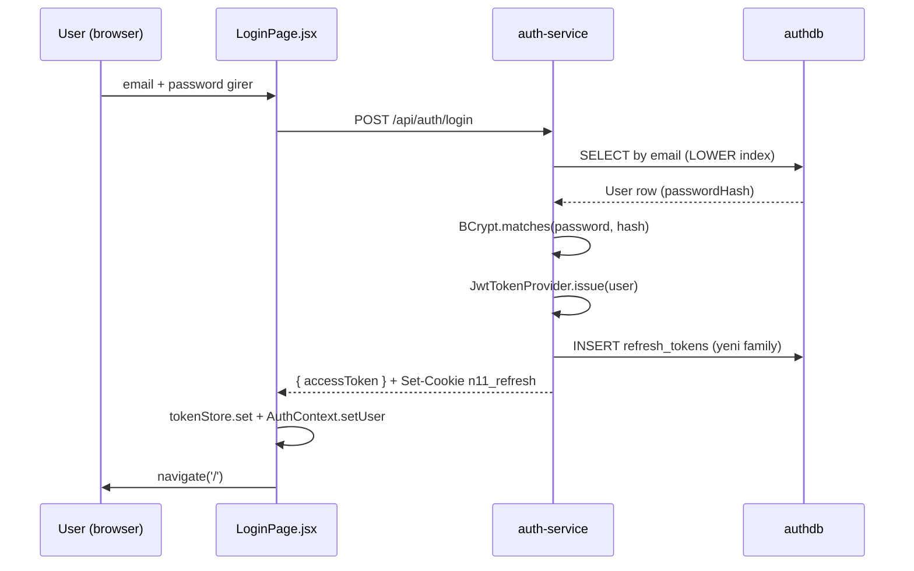
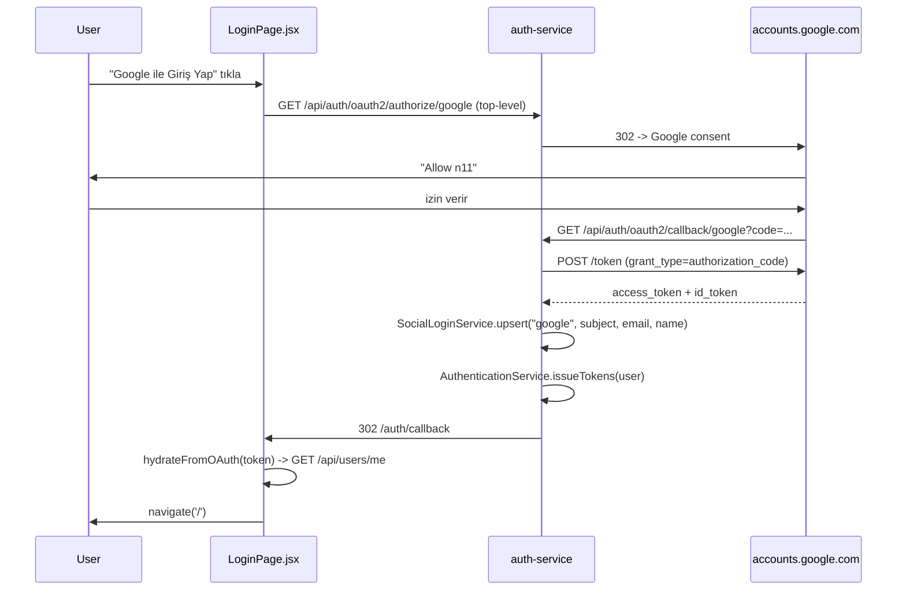
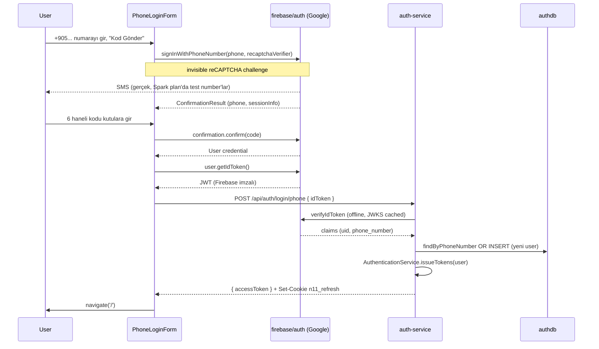
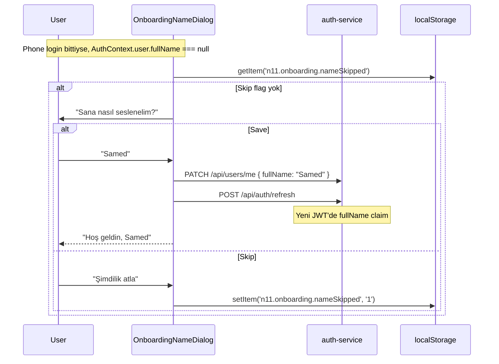
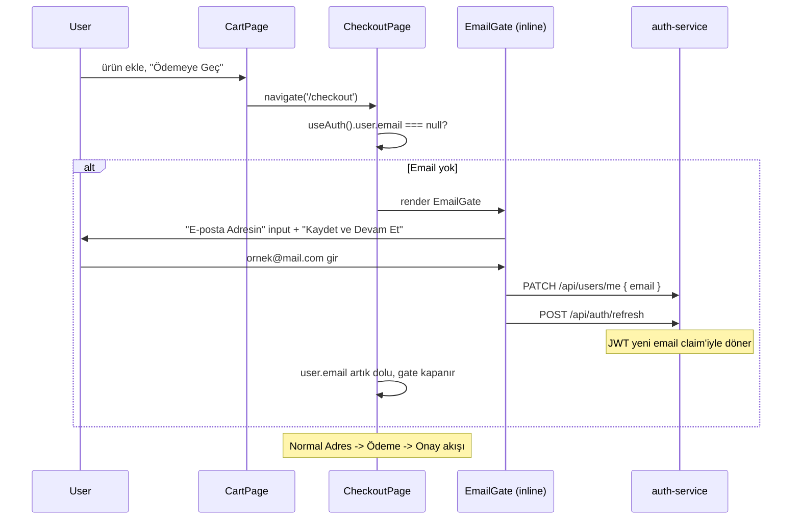

# Auth Flows — Üç Giriş Yolu, Tek Oturum

**Bu doküman:** Storefront'taki üç farklı authentication yolu nasıl çalışır, nerede
biterler, nerede ortak yola dökülürler. Her akış için sequence diagram + kritik dosya
referansları + trade-off'lar.

Üç yol var, hepsi sonunda aynı `AuthenticationService.IssuedTokens` paketini döndürür
(JWT access + opaque refresh) — UI yukarı çıkarken hangi kanaldan geldiğini bilmiyor.
Bu kasıtlı: cart, checkout, orders gibi downstream akışlar `email + Google + phone`
kontrol etmek zorunda kalmıyor.

- [1. Email + Şifre](#1-email--şifre)
- [2. Google OAuth2](#2-google-oauth2)
- [3. Telefon + SMS OTP](#3-telefon--sms-otp-firebase)
- [4. Ortak Çıkış Noktası — JWT + Refresh](#4-ortak-çıkış-noktası--jwt--refresh)
- [5. Onboarding — Kayıt Sonrası "Sana Nasıl Seslenelim?"](#5-onboarding--kayıt-sonrası-sana-nasıl-seslenelim)
- [6. Checkout Email Gate](#6-checkout-email-gate--telefon-only-kullanıcı-için)
- [7. Logout + Refresh Rotation](#7-logout--refresh-rotation)
- [8. Karar Matrisi — Hangi Akış Ne Zaman](#8-karar-matrisi--hangi-akış-ne-zaman)

---

## 1. Email + Şifre

Klasik form login. Mevcut email-kayıtlı kullanıcılar bu yoldan girer.



**Sorumlu dosyalar:**

| Görev | Dosya |
|---|---|
| UI form | `frontend/src/pages/LoginPage.jsx` (`EmailLoginForm`) |
| Frontend HTTP | `frontend/src/state/AuthContext.jsx` (`login`) |
| Endpoint | `backend/auth-service/src/main/java/com/n11/auth/api/AuthController.java` (`@PostMapping("/login")`) |
| Şifre doğrulama | `backend/auth-service/src/main/java/com/n11/auth/service/AuthenticationService.java` (`login()`) |
| JWT üretimi | `backend/auth-service/src/main/java/com/n11/auth/security/JwtTokenProvider.java` (`issue()`) |
| Refresh kayıt | `backend/auth-service/src/main/java/com/n11/auth/service/RefreshTokenService.java` (`issueNewFamily()`) |

**Detaylar:** [`docs/security.md` § JWT](security.md#2-jwt--hs256-servis-tarafında-doğrulama),
[refresh rotation](services/auth-service.md#refresh-token-rotation--reuse-detection).

---

## 2. Google OAuth2

Spring Security'nin built-in OAuth2 client'i. Google'a redirect, callback, biz
JWT veriyoruz.



**Sorumlu dosyalar:**

| Görev | Dosya |
|---|---|
| UI button | `frontend/src/pages/LoginPage.jsx` (`OAUTH_BASE` const) |
| OAuth client config | `backend/auth-service/src/main/resources/application.yml` (`spring.security.oauth2.client`) |
| Success handler | `backend/auth-service/src/main/java/com/n11/auth/security/OAuth2LoginSuccessHandler.java` |
| User upsert | `backend/auth-service/src/main/java/com/n11/auth/service/SocialLoginService.java` |
| Frontend redirect ayar | `frontend/src/api/client.js` (`apiRoot`) |
| Callback parse | `frontend/src/pages/OAuthCallbackPage.jsx` |

**Identity matching:** Google `subject` (sub claim) öncelikli, sonra email fallback.
Mevcut email + şifre hesabı varsa Google login onu **link** eder (mail ile şifresiz girer).

```java
// SocialLoginService.upsert
return repo.findByOauthProviderAndOauthSubject("google", subject)
        .or(() -> repo.findByEmailIgnoreCase(email).map(linkExisting))
        .orElseGet(() -> createNew(...));
```

**Trade-off:** id_token doğrulama Spring Security'ye bırakıldı, biz **email
verified=true** kabul ediyoruz Google geçtiyse — kendi JWKS doğrulamamız yok.
Production'da paranoyaksan id_token claims'ini ayrıca verify edersin.

---

## 3. Telefon + SMS OTP (Firebase)

En yeni eklenen akış. **Modern TR e-ticaret default'u** (Trendyol, Getir, Hepsiburada
hepsi bu modeli kullanıyor). Frontend Firebase Auth'tan SMS atar, kullanıcı kodu
girer, biz Firebase'in döndürdüğü ID token'ı **kendi backend**'de doğrulayıp **kendi
JWT**'mizi vereriz.



**Sorumlu dosyalar:**

| Görev | Dosya |
|---|---|
| UI tab + form + 6-kutu OTP | `frontend/src/pages/LoginPage.jsx` (`PhoneLoginForm`, `OtpInput`) |
| Lazy Firebase init | `frontend/src/lib/firebase.js` (`getFirebaseAuth`, `loadFirebaseAuthFns`) |
| Frontend HTTP | `frontend/src/state/AuthContext.jsx` (`loginWithPhone`) |
| Endpoint | `backend/auth-service/src/main/java/com/n11/auth/api/AuthController.java` (`@PostMapping("/login/phone")`) |
| Firebase init | `backend/auth-service/src/main/java/com/n11/auth/config/FirebaseConfig.java` |
| ID token verify | `backend/auth-service/src/main/java/com/n11/auth/service/FirebaseTokenVerifier.java` |
| User upsert | `backend/auth-service/src/main/java/com/n11/auth/service/PhoneLoginService.java` |
| DB schema | `backend/auth-service/src/main/resources/db/migration/V5__phone_auth.sql` |

### 3.1 Lazy Firebase — Niye?

Firebase JS SDK ~250 kB minified. Eskiden ana bundle'a giriyordu, her sayfa yükleyişi
bu maliyeti ödüyordu. Şimdi:

```js
// frontend/src/lib/firebase.js
export async function getFirebaseAuth() {
  if (cachedAuth) return cachedAuth;
  if (!initPromise) {
    initPromise = (async () => {
      const [{ initializeApp }, { getAuth }] = await Promise.all([
        import('firebase/app'),
        import('firebase/auth'),
      ]);
      // ...
    })();
  }
  return initPromise;
}
```

Vite/Rollup bunu **ayrı chunk** yapar — Firebase sadece kullanıcı `/login`'de phone
tab'ına geldiğinde indirilir. Main bundle 661 kB → 499 kB.

Ek olarak `frontend/index.html`'de **preconnect** hint'leri var:

```html
<link rel="preconnect" href="https://identitytoolkit.googleapis.com" crossorigin />
<link rel="preconnect" href="https://www.googleapis.com" crossorigin />
```

TR'den us-central'a TLS handshake idle'da yapılır, "Kod Gönder" tıklayınca soğuk
başlangıç maliyeti yok.

### 3.2 6-Kutulu OTP UI

Tek input + `tracking: 0.5em` çakar görünüyordu. Şimdi 6 ayrı `<motion.input>`,
auto-focus + paste + Backspace + tamamlanınca submit.

```jsx
// LoginPage.jsx -> OtpInput
function setDigit(idx, char) {
  const digit = char.replace(/\D/g, '').slice(-1);
  const next = padded.slice();
  next[idx] = digit || '';
  onChange(next.join('').trimEnd());
  if (digit && idx < length - 1) refs.current[idx + 1]?.focus();
}
```

iOS'ta SMS notification banner'ı `autocomplete="one-time-code"` ile tek tıklamada
6 kutuya birden basıyor — native UX korunur. Tamamlanan kutu `framer-motion` ile
0.18s scale pulse yapar.

Auto-submit: 6 hane girildiğinde verify otomatik tetiklenir (kullanıcı butona
basmasın diye):

```jsx
<OtpInput
  value={code}
  onChange={(next) => {
    setCode(next);
    if (next.length === 6 && !busy) verifyCode(next);
  }}
/>
```

### 3.3 Backend Verify

Firebase Admin SDK Java client'i, `verifyIdToken` çağrısını **offline** yapar (JWKS
cache 1 saat TTL):

```java
// FirebaseTokenVerifier.verify()
FirebaseToken token = firebaseAuth.verifyIdToken(idToken, true);
Object phoneClaim = token.getClaims().get("phone_number");
if (!(phoneClaim instanceof String phone) || phone.isBlank()) {
    throw new BadCredentialsException("Token has no phone_number claim");
}
return new VerifiedPhoneIdentity(token.getUid(), phone);
```

`true` parametre **token revocation check** açar — Firebase'de admin tarafından
revoke edilen session'lar reddedilir.

### 3.4 Conditional Wiring

`FirebaseConfig` sadece `FIREBASE_SERVICE_ACCOUNT_JSON` env var'ı dolu olduğunda
bean üretir:

```java
@Configuration
@ConditionalOnProperty(prefix = "n11.firebase", name = "service-account-json")
public class FirebaseConfig { ... }
```

`FirebaseTokenVerifier` da `@ConditionalOnBean(FirebaseAuth.class)` ile gated.
Sonuç: dev/CI Firebase config'i olmadan auth-service hâlâ ayağa kalkar, sadece
`/login/phone` endpoint'i 401 döner. Email/Google login'i etkilenmez.

### 3.5 Identity Modeli

`users.phone_number` UNIQUE NULLABLE. Phone-only signup'lar için `email` ve
`full_name` alanları **null** kalabilir (V5 migration NULL constraint'leri kaldırdı).
Greeting mesajları null fallback ile çalışır:

```jsx
const greeting = data.user.fullName || data.user.phoneNumber || 'tekrar';
```

İsim ve email ileride toplanır:
- **İsim** — login sonrası onboarding modal (§5)
- **Email** — checkout sırasında zorunlu gate (§6)

---

## 4. Ortak Çıkış Noktası — JWT + Refresh

Üç yolun da bittiği yer aynı: `AuthenticationService.issueTokens(user, ua, ip)`.

```java
public IssuedTokens issueTokens(User user, String userAgent, String ip) {
    JwtTokenProvider.IssuedToken access = tokenProvider.issue(user);
    RefreshTokenService.Issued refresh = refreshTokenService.issueNewFamily(user, userAgent, ip);
    AuthTokenResponse body = new AuthTokenResponse(
            access.token(), "Bearer", access.expiresInSeconds(),
            access.issuedAt(), userMapper.toDto(user));
    return new IssuedTokens(body, refresh.rawToken(), refresh.expiresInSeconds());
}
```

Frontend ayrımı görmüyor — `applyTokenResponse(data)` her üç yolda aynı işliyor:

```jsx
// AuthContext.applyTokenResponse
tokenStore.set({ accessToken: data.accessToken, user: data.user });
setToken(data.accessToken);
setUser(data.user);
```

Bu **simetri** kritik: cart-service, order-service, payment-service hepsi sadece JWT
tüketiyor; "kullanıcı şifre mi telefonla mı girdi" sorusu hiç gelmiyor.

---

## 5. Onboarding — Kayıt Sonrası "Sana Nasıl Seslenelim?"

Phone-only signup'larda `fullName` null. Kullanıcıyı "+9055..." diye karşılamak
beceriksizce göründüğü için **soft prompt**: tek seferlik modal.



**Sorumlu dosyalar:**

| Görev | Dosya |
|---|---|
| Modal komponenti | `frontend/src/components/OnboardingNameDialog.jsx` |
| Mount noktası | `frontend/src/App.jsx` (Routes ile sibling) |
| Update endpoint | `backend/auth-service/src/main/java/com/n11/auth/api/UserController.java` (`@PatchMapping("/me")`) |

**Niye localStorage?** Skip kararı tek cihaza özel — başka cihazda tekrar sorulabilir,
zarar yok. Sunucuda flag tutmaya değmez (her bilgi user record'unda olmamalı).

**Niye refresh JWT save sonrası?** order-service `user.email/fullName` claim'lerine
güvenir; mevcut JWT 60dk geçerli, eski "fullName=null" claim'le gelmeye devam eder.
Refresh rotation tek call'da yeni claim'leri downstream'a yayar.

---

## 6. Checkout Email Gate — Telefon-Only Kullanıcı İçin

Sipariş onayı maili, fatura, kargo bildirimi — hepsi email gerektiriyor. Phone-only
user checkout'a gelirse **inline gate** açılır, devam etmek için email zorunlu.



**Sorumlu dosyalar:**

| Görev | Dosya |
|---|---|
| Gate komponenti | `frontend/src/pages/CheckoutPage.jsx` (`EmailGate`) |
| `needsEmail` koşulu | `frontend/src/pages/CheckoutPage.jsx` (`const needsEmail = user && !user.email`) |
| Update endpoint | `backend/auth-service/src/main/java/com/n11/auth/api/UserController.java` (`@PatchMapping("/me")`) |
| Server-side zorunluluk | `backend/order-service/src/main/java/com/n11/order/api/OrderController.java` (HTTP 422 if `user.email() == null`) |

### 6.1 Niye Server-Side de Block?

İstemci kontrolü her zaman yeterli değil — biri direkt API call atabilir, frontend
state desync olabilir. order-service'in checkout endpoint'i de aynı şartı zorlar:

```java
// OrderController.checkout
if (user.email() == null || user.email().isBlank()) {
    throw new ResponseStatusException(
        HttpStatus.UNPROCESSABLE_ENTITY,
        "Sipariş için e-posta gerekli. Profilinden ekleyip tekrar dene.");
}
```

Hata 422 (Unprocessable Entity) — UI bunu yakalayıp kullanıcıyı `EmailGate`'e geri
yönlendirebilir.

### 6.2 Niye Just-in-Time Toplama?

"Register'da email + telefon ikisini birden iste" deseydik telefon-first akışın
hikâyesi bozulurdu — Trendyol/Getir bu yüzden **friction'ı kayıt anına atmıyor**,
ihtiyaç anında topluyor. UX araştırma terimiyle "**just-in-time data collection**".

---

## 7. Logout + Refresh Rotation

Logout iki şey yapar:
1. Server'da refresh token row'unu revoke eder (tüm family).
2. Browser'da httpOnly cookie'yi clear eder.

```java
// AuthController.logout
if (refreshCookie != null) {
    refreshTokenService.revoke(refreshCookie);   // family-wide
}
return ResponseEntity.noContent()
        .header(HttpHeaders.SET_COOKIE, cookieFactory.clear().toString())
        .build();
```

Refresh rotation detayları: [`docs/services/auth-service.md` § Refresh Token Rotation](services/auth-service.md#refresh-token-rotation--reuse-detection).

---

## 8. Karar Matrisi — Hangi Akış Ne Zaman

| Durum | Kullanılacak Yol | Niye |
|---|---|---|
| Yeni TR kullanıcısı, mobile-first | **Telefon + OTP** | Sürtünmesiz, default tab |
| Email hesabı zaten olan eski kullanıcı | Email + şifre | Geçerli, dokunulmuş yok |
| Google ekosisteminde yaşıyor | Google OAuth | Tek tıkla, password yönetmez |
| Demo / jüri test | Telefon + OTP (test number) | Firebase Console'da `+905551234567` → `123456` mappingiyle gerçek SMS olmadan akış gösterir |
| Backend test (CI) | Email + şifre | Firebase config olmasa da çalışır, deterministik |

### Test Numbers

Spark plan'da gerçek SMS sınırlı (10/gün) ve Blaze billing istiyor. Demo için
**Phone numbers for testing** kullan:

Firebase Console → Authentication → Sign-in method → Phone → "Phone numbers for
testing":
- Phone: `+905551234567`
- Code: `123456`

Bu numaraya gerçek SMS gönderilmez ama Firebase "kod gönderdim" der ve `123456`
ile doğrulamayı kabul eder. README'de demo credentials olarak kayıtlı.

---

## İlgili Dokümanlar

- [`docs/security.md`](security.md) — JWT, role-based access, rate limiting
- [`docs/services/auth-service.md`](services/auth-service.md) — Endpoint detayları + refresh rotation
- [`docs/services/frontend.md`](services/frontend.md) — UI state management, AuthContext
- [`docs/secrets-management.md`](secrets-management.md) — Firebase service account, Infisical
