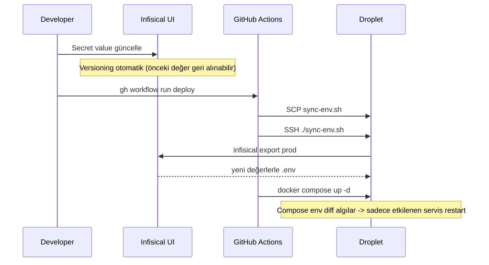

# Secrets Management — Infisical + sync-env.sh

**Bu doküman:** Production secret'ları nasıl yönetiliyor. Kim nereye yazıyor, nasıl
droplet'a iniyor, rotation nasıl çalışıyor. "Coolify-tarzı UI'dan env editle" UX'i
neyle değiştirildi, niye bu yol seçildi.

- [1. Niye Infisical](#1-niye-infisical)
- [2. Akış](#2-akış)
- [3. Komponentler](#3-komponentler)
- [4. Rotation](#4-rotation)
- [5. Bootstrap — İlk Kurulum](#5-bootstrap--i̇lk-kurulum)
- [6. Yeni Secret Ekleme](#6-yeni-secret-ekleme)
- [7. Trade-off'lar ve Limitler](#7-trade-offlar-ve-limitler)

---

## 1. Niye Infisical

Önceki durum: `/opt/n11/.env` dosyası droplet'ta `nano` ile elle düzenleniyordu.
Sorunlar:
- Bir secret değişecekse SSH oturumu açmak gerek
- Multi-developer ortamda kim hangi secret'ı bilir belirsiz
- Audit log yok (kim ne zaman değişti?)
- Backup yok — droplet uçarsa secret'lar kaybolur
- Versioning yok — yanlış değer girdiysen geri alınmıyor

Üç alternatif değerlendirildi:

| Çözüm | Pro | Con |
|---|---|---|
| **Coolify / Dokploy kur** | UI'dan env edit | Host'u "sahiplenir", mevcut Compose + Actions akışını söker. Portfolio için ağır. |
| **Mini admin endpoint** (custom) | Bağımsız, dış servis yok | Yazma yetkisi → güvenlik yükü, retry/audit/version hepsi sıfırdan |
| **Infisical (managed secret manager)** | Web UI, RBAC, audit log, versioning, sync API, free tier | 3rd party'ye bağımlılık (open source, self-host edilebilir) |

Seçim: **Infisical**. Open source olması portfolio'da da iyi görünüyor — "secret
sprawl yok, managed source of truth var, rotate edilebiliyor" hikâyesi.

---

## 2. Akış

```mermaid
flowchart LR
    Dev[Developer / UI] -->|edit| INF[(Infisical Cloud<br/>n11/prod env)]
    INF -->|fetch via Universal Auth| CLI[infisical CLI<br/>on droplet]
    GA[GitHub Actions deploy.yml] -->|SCP sync-env.sh| CLI
    GA -->|SSH script run| SCR[/opt/n11/sync-env.sh]
    SCR -->|infisical export| INF
    SCR -->|atomic write| ENV[/opt/n11/.env]
    ENV -->|--env-file| Compose[docker compose up -d]
    Compose --> Services[7 microservices]
```

**Akış:**
1. Geliştirici Infisical UI'dan bir secret değiştirir (`SMTP_PASSWORD`, `JWT_SECRET`,
   `FIREBASE_SERVICE_ACCOUNT_JSON`, vb.)
2. GitHub Actions `deploy` workflow'u tetiklenir (push veya manuel `workflow_dispatch`)
3. Workflow `sync-env.sh`'i SCP ile `/opt/n11`'e gönderir, sonra SSH ile çalıştırır
4. Script Infisical'dan Universal Auth machine identity ile login olur, prod env'i
   `--format=dotenv` ile çeker, atomic mv ile `/opt/n11/.env`'e yazar
5. `docker compose --env-file .env up -d` değişen env'li servisleri restart eder

**Tek manuel SSH yok**, tek nano yok, kim ne zaman değişti **Infisical UI**'da.

---

## 3. Komponentler

### 3.1 Infisical Project

- Cloud account: `app.infisical.com` (Spark/free tier)
- Project: `n11`
- Environments: `dev`, `staging`, `prod` (sadece `prod` aktif)
- ~44 secret (DB password, JWT, SMTP, Firebase, OAuth client, vb.)

### 3.2 Universal Auth Machine Identity

UI tarafından kullanıcı login'i ile ayrılmış. Droplet kendi credential'ı ile çeker:

- **Identity**: `n11-droplet`
- **Auth method**: Universal Auth
- **Client ID** + **Client Secret** (sırlı)
- **Project role**: Viewer (sadece okuma)

Niye user-bound token değil:
- Token süresi 30 gün
- Bir geliştirici ayrılırsa token'ı silmek yetmez, machine identity yeniden
  oluşturulur
- Audit log "n11-droplet identity fetched secrets" diye gözükür, hangi insanın
  fetch ettiği değil — bu yanlış değil, doğru: makine fetch ediyor

### 3.3 Droplet Auth File

`/opt/n11/.infisical-auth` (chmod 600, owned by `deploy`):

```
INFISICAL_CLIENT_ID=f58d4a75-...-1e015607df80
INFISICAL_CLIENT_SECRET=a88962a61c5cb...
INFISICAL_PROJECT_ID=d7086e77-d27f-48b4-b64b-05b22035e02c
```

Bootstrap-only — Infisical'ın kendisi olamaz (chicken-and-egg). Droplet ilk
provision'da elle yazılır.

### 3.4 sync-env.sh

`infra/digitalocean/sync-env.sh` (repo'da kanonik kaynak, deploy'la SCP olur):

```bash
#!/usr/bin/env bash
set -euo pipefail
source /opt/n11/.infisical-auth

TOKEN=$(infisical login --method=universal-auth \
  --client-id="$INFISICAL_CLIENT_ID" \
  --client-secret="$INFISICAL_CLIENT_SECRET" \
  --plain --silent | tr -d '[:space:]')

infisical export \
  --token="$TOKEN" \
  --projectId="$INFISICAL_PROJECT_ID" \
  --env=prod \
  --format=dotenv > /opt/n11/.env.new

# Boş bundle koruması — Infisical 200 dönüp 0 satır verirse mevcut .env
# silmesin diye sanity check.
if [ "$(wc -l < /opt/n11/.env.new)" -lt 5 ]; then
  echo "Infisical export looks empty, aborting." >&2
  rm -f /opt/n11/.env.new
  exit 1
fi

mv /opt/n11/.env.new /opt/n11/.env   # atomic
chmod 600 /opt/n11/.env
echo "Synced $(grep -cE '^[A-Z_]' /opt/n11/.env) secrets from Infisical."
```

**Üç koruma:**
- `--token` her seferinde fresh login (cached token'a güvenmez)
- Atomic mv — yazma sırasında kesilirse `.env` bozulmaz
- Sanity check — empty bundle'ı reddeder

### 3.5 GitHub Actions Wiring

`.github/workflows/deploy.yml` Pull & restart adımı:

```yaml
script: |
  set -euo pipefail
  cd /opt/n11
  chmod +x sync-env.sh 2>/dev/null || true
  if [ -x ./sync-env.sh ]; then
    ./sync-env.sh
  else
    echo "::warning::sync-env.sh missing, using existing .env"
  fi
  # ... IMAGE_TAG sed + docker compose pull/up
```

**Fallback yumuşak**: script yoksa (ilk run, eski droplet) mevcut `.env` ile devam
eder, ölmez.

---

## 4. Rotation

Bir secret değişmesi gereken durum:
- Periyodik routine (örn. JWT_SECRET her 90 günde)
- Compromise (Slack/PR'da yanlışlıkla paylaşıldı)
- Provider rotate etti (Resend API key sıfırdan üretildi)

**Akış:**



**Niye full deploy** (sadece env sync değil)? Compose env değişikliğini sadece
`up -d` algılayıp restart ediyor; Spring Boot env'leri çalışırken yeniden okumaz.
Service başına manuel restart yerine workflow tetiklemek daha temiz.

---

## 5. Bootstrap — İlk Kurulum

Tek seferlik, yeni droplet provision'unda yapılır:

```bash
# 1. Infisical CLI kur
curl -1sLf 'https://artifacts-cli.infisical.com/setup.deb.sh' | sudo -E bash
sudo apt-get install -y infisical

# 2. Auth file'ı yaz (chmod 600, owned by deploy user)
echo 'INFISICAL_CLIENT_ID=...' > /opt/n11/.infisical-auth
echo 'INFISICAL_CLIENT_SECRET=...' >> /opt/n11/.infisical-auth
echo 'INFISICAL_PROJECT_ID=...' >> /opt/n11/.infisical-auth
chown deploy:deploy /opt/n11/.infisical-auth
chmod 600 /opt/n11/.infisical-auth

# 3. İlk sync
/opt/n11/sync-env.sh   # repo'dan SCP edilmiş olmalı, ya da manuel kopyala
```

Sonraki tüm deploy'lar `gh workflow run deploy` ile tetiklenir, manuel SSH yok.

---

## 6. Yeni Secret Ekleme

1. Infisical UI → `n11/prod` env → "Add Secret"
2. `infra/digitalocean/.env.example`'a checklist olarak ekle (referans için)
3. `infra/digitalocean/docker-compose.prod.yml`'de servisin env block'una map et:
   ```yaml
   environment:
     NEW_THING: ${NEW_THING:-default-value-or-empty}
   ```
4. Servis kodunda `application.yml` ile karşıla:
   ```yaml
   n11:
     new-thing: ${NEW_THING:default-value}
   ```
5. Commit + push → Actions otomatik tetiklenir → sync-env.sh çeker → compose
   restart eder

`.env.example` kanonik kaynak değil, **checklist**. Gerçek değerler Infisical'da.

---

## 7. Trade-off'lar ve Limitler

### Pro

- **Tek kaynak** — kim ne zaman değişti UI'da görünür
- **RBAC** — Viewer / Editor / Admin role'leri
- **Audit log** — secret access geçmişi
- **Versioning** — yanlış değer geri alınabilir
- **Sync API** — script-friendly, CI/CD entegrasyonu temiz
- **Free tier** — portfolio scope için yeter (5 user, sınırsız secret)

### Con

- **3rd party bağımlılığı** — Infisical kapanırsa veya outage olursa ne olur
- **Network latency** — sync sırasında us-east'a request, ~200ms eklenir
- **Bootstrap chicken-and-egg** — `.infisical-auth` Infisical'da olamaz

### Mitigasyonlar

- Infisical self-host'u var (Docker compose + Postgres) — kapanırsa kendi kendine
  host'larız. Migration: secret'ları export edip self-host'a import et.
- Outage'da mevcut `.env` zaten droplet'ta, deploy etkilenmez. Sadece **yeni**
  secret eklemek gecikir.
- Bootstrap auth file 600 mode + machine identity zaten role-limited (Viewer);
  sızsa bile dış erişimden bir Reader yaratır.

### Bilinmeyen Limitler

- **Free tier rate limit**: ~100 req/dk. Deploy frekansı düşük olduğu için yetiyor.
  CI'da deploy günde max 10 kere tetiklenir.
- **Secret size**: tek secret max 10 kB. `FIREBASE_SERVICE_ACCOUNT_JSON` ~2 kB —
  rahat sığar.

---

## İlgili Dokümanlar

- [`docs/deployment.md`](deployment.md) — Droplet provisioning playbook
- [`docs/cicd.md`](cicd.md) — GitHub Actions workflow
- [`infra/digitalocean/.env.example`](../infra/digitalocean/.env.example) — Secret checklist
- [`infra/digitalocean/sync-env.sh`](../infra/digitalocean/sync-env.sh) — Sync script
